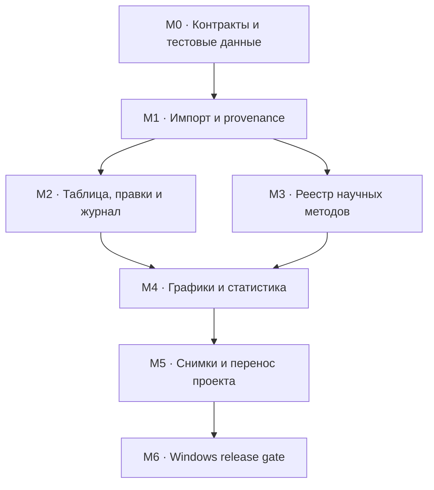

# PetroLab Desktop v2: план реализации после аудита Streamlit v1

**Статус:** исполняемый архитектурный план  
**Дата:** 2026-08-30  
**Основание:** `LEGACY_STREAMLIT_AUDIT_REPORT_2026-08-30.md`, ADR-0010, утверждённые US-01–US-32 и AT-01–AT-38  
**Граница:** документ задаёт порядок vertical slices и критерии выхода; он не утверждает новый UI и не переносит код Streamlit.

Пользовательская последовательность поставки `Project → … → Restore` и состав срезов A–G описаны в `docs/product/DESKTOP_V2_IMPLEMENTATION_SEQUENCE.md`. Здесь те же работы сгруппированы по архитектурным зависимостям M0–M6, поэтому документы дополняют, а не дублируют друг друга.

## 1. Результат

Desktop v2 должен получить полезные научные возможности старой версии без её архитектурных связей: формулы и импорт остаются в Python core, хранилище не знает о React-компонентах, интерфейс не принимает научные решения за пользователя. Реализация идёт сквозными проверяемыми срезами, а не изолированными слоями приложения.

Три первых контракта после аудита уже формализованы JSON Schema:

- `Import Recipe` — воспроизводимый смысл импорта, включая Fe-семантику, единицы и политику дубликатов;
- `Scientific Method Definition` — версия метода, область применимости, реализация и benchmark evidence;
- `Workspace Snapshot` — точные ссылки для продолжения работы без копирования Measurement и без превращения Selection в сохранённую сущность.

## 2. Порядок зависимостей

Развилка M2/M3 допустима для разработки, но M4 нельзя принимать без обеих ветвей: статистика требует устойчивого набора Analysis и одновременно версионированного метода.

## 3. Общие правила каждого vertical slice

Каждый срез обязан включать:

1. JSON Schema команды и результата либо явную ссылку на существующую схему.
2. Python domain/service implementation без импорта UI и SQLite adapter.
3. SQLite migration и repository adapter, если появляется сохраняемая сущность.
4. React-проекцию утверждённого состояния, если экран уже принят пользователем.
5. Наблюдаемый acceptance test с устойчивыми ID и доказательством неизменности источника.
6. Ошибочный сценарий: несовместимые данные, конфликт, отмена или восстановление после сбоя.
7. Benchmark или golden dataset для любого научного результата.

Временные in-memory реализации допустимы только внутри теста. Compatibility wrapper, копирующий Streamlit session state или старые page-модули, запрещён без отдельного ADR.

## 4. M0 — контрактный фундамент

**Цель:** сделать термины аудита исполняемыми до появления production UI.

### Состав

- схемы и примеры `Import Recipe`, `Scientific Method Definition`, `Workspace Snapshot`;
- валидатор всех примеров без сетевой зависимости;
- отрицательные тесты границ: silent merge, pseudocount, смешанный домен, сохранённый Selection;
- фиксированные UUID и SHA-256 в contract fixtures;
- соответствие `legacy feature → decision → owner → milestone → acceptance`.

### Выход

- `python scripts/validate_contracts.py` проходит;
- `python -m unittest discover -s tests` проходит;
- изменение схемы без обновления примера обнаруживается CI;
- утверждённые экраны не меняются.

## 5. M1 — воспроизводимый импорт и provenance

**Пользовательский результат:** исследователь один раз разбирает структуру файла и неоднозначности, затем безопасно повторяет тот же импорт на совместимом файле.

### Vertical slice M1.1 — preview без записи

Команды:

- `import.inspect_source` — листы, диапазоны, заголовки, предполагаемые блоки и контрольная сумма;
- `import.recipe.validate` — совместимость колонок, единиц и семантических решений;
- `import.plan.create` — будущие Analysis/Measurement, предупреждения и ошибки без записи в проект.

Обязательные проверки:

- Excel/CSV остаётся байт-в-байт неизменным;
- лист, строка и исходное имя колонки не теряются;
- decimal comma, `<DL>` и missing token различаются;
- `FeO`, `Fe2O3`, `FeOt` и `Fe2O3t` не объединяются без решения;
- неизвестная единица блокирует Measurement, а не превращается в текстовое примечание.

### Vertical slice M1.2 — атомарное применение

Команды:

- `import.plan.apply` — одна транзакция, Import Batch, frozen recipe snapshot и provenance;
- `import.batch.rollback` — отмена только целого незавершённого batch;
- `import.recipe.save_revision` — новая версия вместо перезаписи применённой.

Дубликат никогда не сливается автоматически. Доступны только `review`, `reject_batch`, `keep_separate`; выбранная политика входит в отчёт.

### Vertical slice M1.3 — managed и linked source

- `managed_copy` хранит контролируемую копию и её SHA-256;
- `linked_reference` хранит путь/идентификатор и последний проверенный SHA-256;
- изменение внешнего файла создаёт состояние `source_changed`, а не молчаливую синхронизацию;
- повторное применение recipe создаёт новый Import Batch.

**Связанные сценарии:** US-02, US-03, US-32; AT-02, AT-03, AT-38.

## 6. M2 — таблица, черновики и обратимые действия

**Пользовательский результат:** массовая работа становится быстрой, но ни виртуализация, ни перезапуск, ни внешний Excel не меняют состав и значения молча.

### Vertical slice M2.1 — стабильная табличная проекция

- server-side query по устойчивому `analysis_id`;
- Column Filter, сортировка и группировка хранятся в `Table View`;
- Selection хранится отдельно от Filter, Work Group и закрепления строк;
- «выбрать видимые» и «выбрать весь результат» возвращают разные, явно подписанные множества;
- экспорт Selection получает точный список ID до начала записи файла.

### Vertical slice M2.2 — Edit Draft

- draft хранит прежнее значение, предлагаемое значение и fingerprint источника;
- draft переживает перезапуск, но не считается Measurement;
- перед commit сервис повторно читает fingerprint;
- конфликт показывает `base/current/proposed` и требует явного решения;
- запись во внешний файл допускается только после backup и атомарной замены.

### Vertical slice M2.3 — Operation Journal

Первая поддерживаемая группа inverse actions:

- назначение/снятие Generation;
- создание/снятие Analysis–Analytical Point link;
- массовое изменение подтверждаемого QC-статуса;
- view-only hide/show хранится отдельно и не маскируется под научную правку.

В журнале обязательны actor, timestamp, exact entity IDs, action kind, parameters, outcome и inverse payload. Undo сначала проверяет текущие ревизии затронутых сущностей.

**Связанные сценарии:** US-06, US-20, US-25, US-30, US-31; AT-06, AT-16, AT-17, AT-26, AT-32, AT-36, AT-37.

## 7. M3 — реестр научных методов

**Пользовательский результат:** любой Derived Value или Calculation Run можно объяснить ссылкой на метод, точные входы, параметры, версию реализации и проверочный набор.

### Vertical slice M3.1 — Scientific Method Registry

- методы загружаются из контролируемого bundled registry;
- проект ссылается на immutable method ID/version;
- изменение текста, параметров, алгоритма или guards создаёт новую версию;
- deprecated method остаётся доступным для чтения старого результата;
- `validated` невозможен без хотя бы одного benchmark case.

### Vertical slice M3.2 — Calculation fingerprint и stale

Fingerprint включает:

- отсортированные Measurement/Derived Value ID и их ревизии;
- method ID/version и implementation SHA-256;
- нормализованные параметры;
- решения о единицах, Fe-семантике и композиционном домене.

Изменение любого элемента делает старый результат `stale` с машинно-читаемой причиной. Пересчёт создаёт новую ревизию; старый результат и его provenance сохраняются.

### Vertical slice M3.3 — первая научная лестница

Порядок переноса определяется проверяемостью и текущими экранами:

1. CLR/ILR и Aitchison variation с жёсткими domain guards.
2. Описательная статистика, effect size и multiple-comparison correction.
3. PCA.
4. K-means и hierarchical clustering с seed/parameters.
5. Поля hull/ellipse/KDE.
6. Минеральные формулы по одному семейству за срез.
7. Mineral Recognition как предложение, а не автоматическое назначение.

Thermobarometry, thermodynamics и partitioning остаются только в registry backlog, пока для конкретного метода нет источника, applicability, benchmark и отдельного приёмочного сценария.

**Связанные сценарии:** US-11, US-12, US-13, US-23, US-24, US-28, US-29; AT-11, AT-12, AT-29, AT-30, AT-31, AT-35.

## 8. M4 — графики и пошаговая статистика

**Пользовательский результат:** один набор анализов можно сравнивать, скрывать как представление, превращать в поля и исследовать статистически без потери состава и происхождения.

### Vertical slice M4.1 — Plot Specification round-trip

- до восьми видимых панелей и больше сохранённых панелей;
- стабильная Legend Definition;
- общая Selection overlay без изменения series style;
- отдельные Filter, hidden analysis mask и `show_points`;
- Corel-safe SVG проверяется структурно, не только визуально.

### Vertical slice M4.2 — Plot Layers и Fields

Каждый слой хранит exact input, z-order, opacity, point visibility и optional Field definition. Поле хранит method ID/version и параметры. `show_points=false` скрывает маркеры, но сохраняет вход поля; Plot Visibility исключает Analysis и из маркеров, и из расчёта поля.

### Vertical slice M4.3 — guided statistics

Пять утверждённых состояний реализуются как один workflow:

1. Задача.
2. Состав данных.
3. Метод.
4. Результат сравнения.
5. Кластеризация и создание Work Groups.

Переход к методу блокируется, если units/domain/positivity нарушают его guards. Euclidean exploratory path остаётся возможным как отдельный явно названный метод. Cluster label не становится Generation автоматически.

**Связанные сценарии:** US-08, US-09, US-12, US-14, US-16, US-21, US-22, US-23, US-24; AT-07, AT-08, AT-12, AT-18, AT-27, AT-28, AT-29, AT-30.

## 9. M5 — продолжение работы и перенос проекта

**Пользовательский результат:** после перезапуска возвращается точный исследовательский контекст, а проект переносится между компьютерами с проверкой целостности.

### Vertical slice M5.1 — Workspace Snapshot

Snapshot сохраняет Data Universe, Table View, Plot Specifications, Source/Calculation Run visibility, semantic focus, revisions ссылок и явную политику Selection: начать с пустого либо восстановить точный список Analysis ID. Он не хранит координаты панелей React, не создаёт копии Measurement и не превращает восстановленный Selection в Work Group.

При восстановлении сервис возвращает отчёт:

- `restored` — ссылка и ревизия совпали;
- `updated` — сущность существует, но ревизия изменилась;
- `missing` — ссылка отсутствует;
- `incompatible` — поле/единица больше не поддерживаются.

Частичное восстановление всегда подтверждается пользователем.

### Vertical slice M5.2 — Analysis Template

Template содержит структуру Table View, панели и ссылки на методы, но не содержит Analysis/Source/Dataset ID. Применение сначала сопоставляет поля и единицы и показывает план совместимости.

### Vertical slice M5.3 — portable `.petrolab`

Три уровня:

- `project` — база, recipes, snapshots и manifest;
- `project+sources` — плюс managed source files;
- `full` — плюс scientific originals и явно выбранные производные материалы.

Импорт архива выполняет path-traversal guard, проверку SHA-256 manifest, SQLite integrity check, schema migration preview и backup непустого workspace до замены.

**Связанные сценарии:** US-15, US-26, US-27; AT-13, AT-33, AT-34.

## 10. M6 — release gate Windows Desktop

Первый публикуемый installer допускается только после:

- clean install на поддерживаемой Windows;
- открытия нового и миграции старого проекта;
- прохождения AT-01, AT-02, AT-06, AT-07, AT-09, AT-12, AT-14;
- round-trip одного Import Recipe, Scientific Method Definition и Workspace Snapshot;
- восстановления после принудительного завершения во время draft, import preview и export;
- проверки, что stderr/log не содержит значений Measurement и путей источников по умолчанию;
- проверки производительности на фиксированном большом наборе без изменения научного результата.

## 11. Реестр рисков

| Риск | Ранний сигнал | Защита | Блокирует |
|---|---|---|---|
| Старый алгоритм выглядит правдоподобно, но не подтверждён | нет источника или benchmark | статус `draft`, запрет утверждать перенос | M3/M4 для метода |
| UI повторяет старый session state | ID зависят от строк/виджетов | contract tests и устойчивые UUID | любой срез |
| Recipe применён частично | есть Analysis без batch/provenance | preview + одна транзакция | M1 |
| External Excel перезаписан после изменения | fingerprint не совпал | conflict + backup + atomic replace | M2 |
| CLR/ILR смешивает домены | Mg#, oxide и APFU в одном input | domain guard, явная subcomposition | M3/M4 |
| Snapshot превращается в скрытую копию данных | внутри лежат Measurements или неописанный `selection_ids` | schema разрешает Selection только через явную restore policy | M5 |
| Portable archive небезопасен | абсолютный путь или `..` в manifest | canonical path validation до extract | M5 |
| Экспорт визуально верен, но не редактируем | SVG содержит clipPath/mask/raster | структурная Corel-safe проверка | M4/M6 |

## 12. Не входит в текущую версию

- отдельный экран и классификационный workflow пород/whole-rock;
- копирование старого Streamlit UI, navigation wrappers или session keys;
- хранение PDF публикаций как обязательное условие Source;
- collaboration/sync между пользователями;
- автоматическая геологическая интерпретация кластеров;
- production UI для метода без утверждённого состояния и benchmark evidence.

Доменная модель Rock Type/Rock Assignment сохраняется, чтобы следующая версия не требовала разрушительной миграции, но UI пород не включается в M0–M6.

## 13. Definition of Ready для первой реализации

Начинать код M1 можно, когда одновременно выполнено следующее:

- схемы и примеры M0 проходят валидацию;
- fixture-файл импорта содержит multi-sheet, Fe ambiguity, `<DL>`, missing values и duplicate candidates;
- для каждой команды M1 описаны result/error projections;
- согласован способ хранения linked source path без попадания пользовательских путей в диагностические логи;
- создана минимальная SQLite migration только для M1, без таблиц будущих экранов;
- QA заранее знает, какие SHA-256 и counts должны совпасть.

Следующая инженерная задача после этого документа — один vertical slice M1.1 `inspect → recipe validation → import plan`, без записи в проект и без production UI за пределами уже утверждённого экрана импорта.
