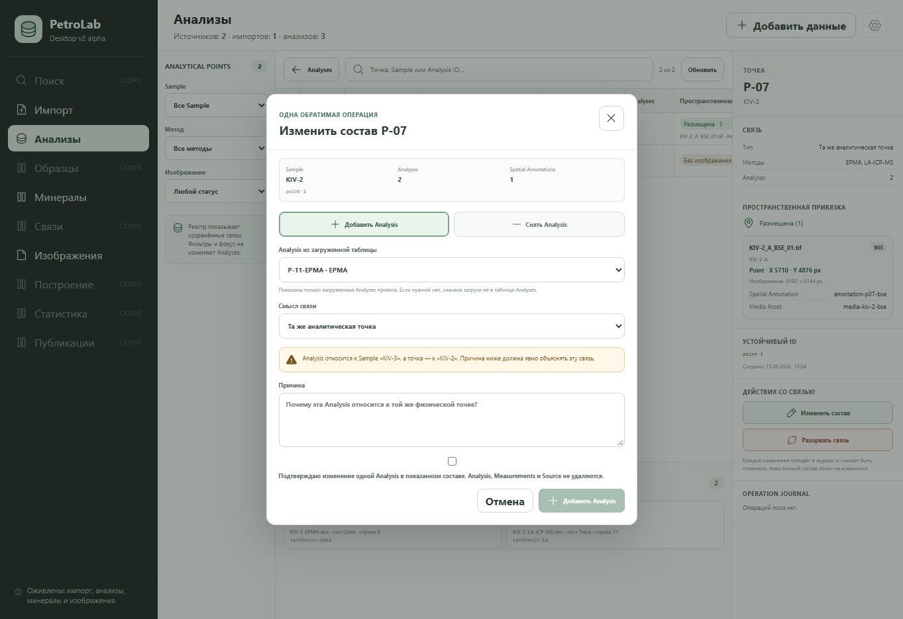

# Analytical Point composition slice — 2026-09-21

## Scope

This bounded slice lets a user add or remove exactly one Analysis from an
active Analytical Point. Every change requires an explicit reason, checks the
exact Analysis and Spatial Annotation scope seen by the user, and writes an
inverse operation to the Operation Journal.

The operation changes only `analytical_point_analysis`. Analysis, Measurement,
Source, Spatial Annotation and Media Asset rows are not edited or deleted. A
point must retain at least two Analyses.

## Observable acceptance

- `Изменить состав` opens a dialog for the focused point.
- The dialog shows current Sample, Analysis count, Spatial Annotation count and
  stable Point ID.
- One loaded Analysis can be added with an explicit link type and reason.
- One current Analysis can be removed only when at least two Analyses remain.
- A cross-Sample candidate is visibly called out before confirmation.
- A stale current scope returns `POINT_REVISION_CONFLICT` without a partial
  relation or journal write.
- Add and remove operations expose immediate Undo through the existing banner.
- Undo uses stable IDs and restores the saved link type.

## Data-safety evidence

Python tests compare `analysis`, `measurement` and `source_file` row counts
across membership changes. Tests also cover the two-Analysis floor, stale-scope
rejection, transport commands, link-type restoration and both inverse effects.

## Verification

- `python scripts/validate_contracts.py` — PASS.
- `python -m unittest discover -s tests` — 184 tests PASS.
- UI and real-Python integration tests — 37 tests PASS.
- Tauri shell contracts — 24 tests PASS.
- Sites worker/package checks — 4 tests PASS.
- Vite production build — PASS.

Native Tauri execution was not repeated because `cargo` and `rustc` are not
available in this environment.

## Visual evidence

Synthetic project state at 1363 × 936. The dialog shows the exact current
scope, one-operation boundary, cross-Sample warning and non-deletion guarantee.

## Verdict

Accepted for the bounded add/remove-one-Analysis composition scope, including
exact-scope conflict handling and Undo.
