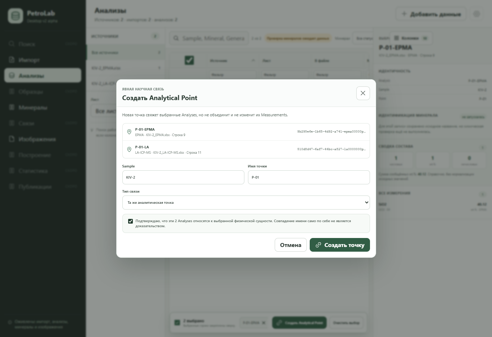

# Analytical Point linking slice — 2026-09-15

Scope: branch `codex/vscode-working-2026-09-14`, based on `cd3eef9`.
This slice closes the image-workspace gap recorded in
`PR22_NATIVE_ACCEPTANCE_2026-09-15.md`: a user can now create a persisted
`AnalyticalPoint` from selected existing Analyses before placing it on an
image.

## Implemented behavior

- The Analyses workspace enables point creation only after at least two
  Analyses are selected.
- The dialog shows exact Analysis IDs, method/source provenance and the Sample
  identity supplied by each source row.
- Exact common Sample and Point fields may be prefilled, but no link is saved
  until the user chooses a link type and explicitly confirms the semantics.
- Identical Point text is presented as context only and is never treated as
  proof of `same_point` by React or Tauri.
- Different source Samples produce a visible warning and require an explicit
  target Sample.
- Cancel, outside click and Escape leave the project unchanged.
- Confirmed creation uses the existing Python command
  `analytical_point.create`; the point projection is then refreshed for the
  image workspace. If refresh fails after the write, the dialog still closes
  and reports that the point was created, preventing an accidental duplicate
  retry.
- An in-progress image batch is retained while the user visits Analyses. After
  a successful create and refresh, the user returns to point placement.

The implementation follows US-17/US-18, AT-20/AT-22 and the M2 rule that
Analytical Points are explicit cross-method entities. Existing Measurements,
source files and image bytes are not modified by this flow.

## Visual evidence

The real React component tree was checked at 1363 × 936 with a deterministic
Tauri response fixture. The dialog fits without horizontal clipping and keeps
identity, provenance, semantics and confirmation visible together. This image
is UI evidence; persisted database behavior is covered separately by the
Python and NDJSON tests.



## Automated verification

```text
python scripts/validate_contracts.py                         PASS
PYTHONPATH=src python -m unittest discover -s tests           176 PASS
cd desktop && npm run test:ui                                33 PASS
cd desktop && npm run test:tauri-contract                    23 PASS
cd desktop && npm run build                                  PASS
cd desktop && npm run test:sites                              4 PASS
```

The UI set includes explicit-confirmation and cancel coverage, the exact
`analytical_point.create` payload, projection refresh, and the post-write
refresh-failure regression. Existing Python coverage verifies stable point
identity, listing, media placement geometry and reopen behavior.
