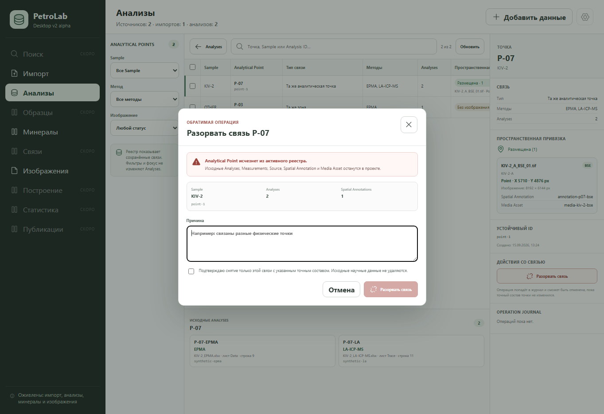

# Analytical Point Operation Journal slice — 2026-09-21

## Scope

This slice completes the first bounded Operation Journal path for Analytical
Points. Creating or retiring a whole Analytical Point writes an auditable entry
with actor, timestamp, exact entity IDs, parameters, outcome and inverse
payload. Retiring is logical: it removes the point from active projections but
does not delete the Analytical Point, contributing Analyses, Measurements,
Source, Spatial Annotations or Media Assets.

The slice deliberately does not edit membership one Analysis at a time and
does not implement Generation, QC or view-only visibility journal actions.

## Observable acceptance

- The registry inspector exposes `Разорвать связь` for the focused point.
- Confirmation lists the exact Analytical Point, Analysis count and Spatial
  Annotation count and requires both a reason and an explicit checkbox.
- The operation refreshes the active registry and exposes Undo.
- Undo checks the current exact scope before restoring or retracting the point.
- A stale Analysis or Spatial Annotation scope returns
  `POINT_REVISION_CONFLICT` without writing a retraction or partial journal
  operation.
- The registry shows recent Operation Journal entries with action, outcome,
  actor, timestamp and affected counts.

## Data-safety evidence

Python tests compare row counts before and after retire/undo for `analysis`,
`measurement`, `analytical_point` and `analytical_point_analysis`. The original
rows remain present. `analytical_point_retraction` is the only active-state
marker. Media planning rejects retracted points while their saved spatial rows
remain available for a valid restore.

## Verification

- `python scripts/validate_contracts.py` — PASS.
- `python -m unittest discover -s tests` — 181 tests PASS.
- UI and real-Python integration tests — 36 tests PASS.
- Tauri shell contracts — 24 tests PASS.
- Vite production build — PASS.
- Sites worker/package checks — 4 tests PASS.

Native Tauri execution was not repeated because `cargo` and `rustc` are not
available in this environment.

## Visual evidence

Synthetic project state at 1363 × 936, before confirmation. The dialog shows
the exact scope and the non-deletion guarantee.

## Verdict

Accepted for the bounded Analytical Point create/retire/undo scope. AT-37 as a
whole remains partial until Generation and view-only actions are implemented.
