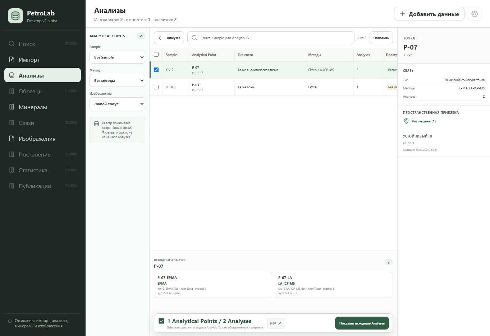

# Analytical Point registry slice — 2026-09-15

Scope: branch `codex/vscode-working-2026-09-14`, based on the explicit point
creation commit `2a6a08d`. This is the next read-only slice of section 12.2 in
the Product UX specification; it does not yet add edit, unlink, Operation
Journal or Plotting actions.

## Implemented behavior

- The Analyses workspace opens a dedicated registry backed by the existing
  `analytical_point.list` command.
- The projection now returns stored link types and creation time in addition to
  stable Point/Analysis IDs, Sample, methods and placement count.
- The registry filters by Sample, method, placement status and text without
  changing persisted entities.
- A focused point exposes its exact source Analysis IDs and available
  Source/sheet/row provenance.
- Selected registry rows remain pinned. The selection bar reports both
  Analytical Point and source Analysis counts.
- “Показать исходные Analyses” returns only the persisted Analysis IDs to the
  existing Analyses table; it does not synthesize or aggregate Measurements.
- A newly created point opens in the registry after its projection refresh. A
  failed post-write refresh leaves the user in Analyses with an explicit error,
  avoiding both a stale registry claim and a duplicate create retry.
- Cancelling or completing an image batch no longer clears the project-wide
  point projection. Successful media import refreshes it so placement status is
  current.

The same backend projection is shared by the registry and image placement.
React does not infer point membership, link type or Sample equivalence.

## Visual evidence

The real React component tree was checked at 1363 × 936 using the repository's
explicit synthetic Tauri fixture. The selected point, two source Analyses,
placement status, stable ID and the dual-count Selection bar remain visible.
The wide registry table scrolls horizontally while the inspector and Selection
bar stay fixed.



## Automated verification

```text
python scripts/validate_contracts.py                         PASS
PYTHONPATH=src python -m unittest discover -s tests           176 PASS
cd desktop && npm run test:ui                                34 PASS
cd desktop && npm run test:tauri-contract                    23 PASS
cd desktop && npm run build                                  PASS
cd desktop && npm run test:sites                              4 PASS
```

The registry UI test covers link semantics, placement status, stable IDs,
method filtering, source provenance, dual counts and the exact return to
Analysis Selection. The backend test verifies persisted link type and creation
time in the read-only projection. Native Tauri launch was not repeated because
the local environment does not contain `cargo` or `rustc`.
