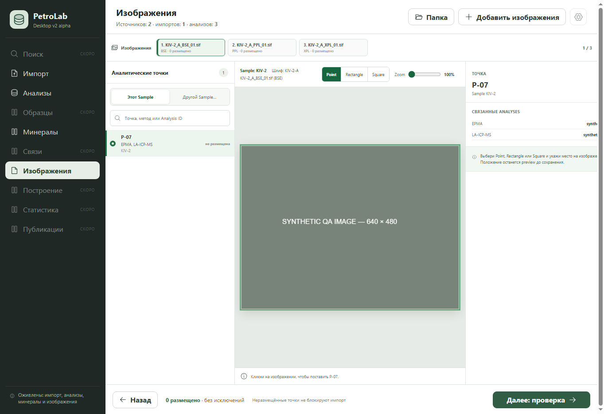

# Срез 1 — точные Analysis ID в точках

Статус: завершён 2026-09-22.

## Результат

Проекция Analytical Point теперь возвращает `analysis_members`: для каждой связанной Analysis отдельно сохранены её ID, метод и физическое происхождение в источнике. Интерфейс точек и карточка исходных Analyses берут метод и источник по ID, а не сопоставляют индекс элемента с агрегированным списком методов.

Кнопка «Показать исходные Analyses» запрашивает ровно выбранные ID, в том числе если они не входят в первую страницу из 500 строк. Загруженные записи добавляются к текущему локальному списку без сдвига offset следующей обычной страницы. Если ID больше не активен, это показано явно, а не исключается молча.

## Приёмка

- Python: каждая `analysis_members[].analysis_id` совпадает с соответствующей исходной Analysis; у члена есть собственные method и source.
- Python: `list_project_analyses(..., analysis_ids=[...])` возвращает точный набор вне текущей страницы.
- NDJSON: `project.analyses.list` принимает `analysis_ids` и возвращает только их.
- UI: переход из реестра вызывает запрос с обоими ID и показывает Analysis, которой не было в обычной странице.
- Визуально: в QA fixture вручную выбрана P-07; EPMA и LA-ICP-MS показаны как отдельные связанные Analysis.
