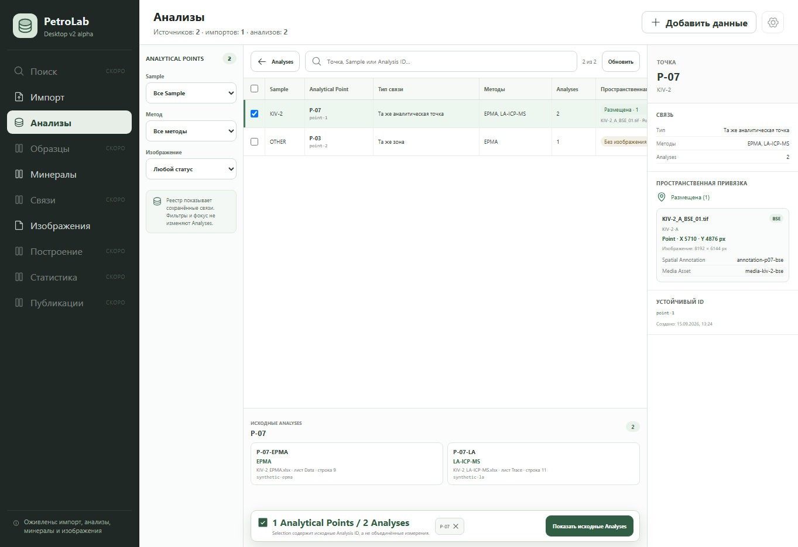

# Analytical Point spatial provenance slice — 2026-09-15

Scope: branch `codex/vscode-working-2026-09-14`, based on the registry commit
`7e133b1`. This read-only slice completes the spatial evidence shown for a
saved Analytical Point. It deliberately does not add unlink/delete actions;
those require the still-unimplemented Operation Journal contract.

## Implemented behavior

- `analytical_point.list` returns every saved placement with stable Spatial
  Annotation, Media Asset and Thin Section IDs.
- Each placement includes media display name/type, Thin Section name,
  source-pixel Point/Rectangle/Square geometry, original image dimensions,
  link time and the persisted cross-Sample exception state/reason.
- The projection does not return full-resolution pixels or decode media during
  registry loading.
- The registry table shows the first saved image and coordinate summary while
  preserving the existing placement-count status.
- The inspector lists every placement and exposes exact IDs and geometry. A
  cross-Sample placement is visibly labelled with its stored reason.
- Formatting happens only for presentation. Coordinates remain the numeric
  values owned and validated by Python; React does not infer or transform
  geometry.

No Analysis, Measurement, source image, Media Asset or Spatial Annotation is
modified by opening, filtering or selecting the registry.

## Visual evidence

The real React tree was checked at 1363 × 936 with the explicit synthetic Tauri
fixture. The selected P-07 exposes its BSE image, Thin Section, X/Y coordinates,
original image dimensions and both stable spatial IDs while the source Analyses
and dual-count Selection bar remain visible.



## Automated verification

```text
python scripts/validate_contracts.py                         PASS
PYTHONPATH=src python -m unittest discover -s tests           176 PASS
cd desktop && npm run test:ui                                34 PASS
cd desktop && npm run test:tauri-contract                    23 PASS
cd desktop && npm run build                                  PASS
cd desktop && npm run test:sites                              4 PASS
```

Backend coverage verifies exact Point geometry, image dimensions, stable
Spatial Annotation/Media Asset IDs, Thin Section and both same-Sample and
cross-Sample provenance after media import. UI coverage verifies Point and
Square rendering, stable IDs, image dimensions and the exception reason.
Native Tauri launch was not repeated because the local environment does not
contain `cargo` or `rustc`.
