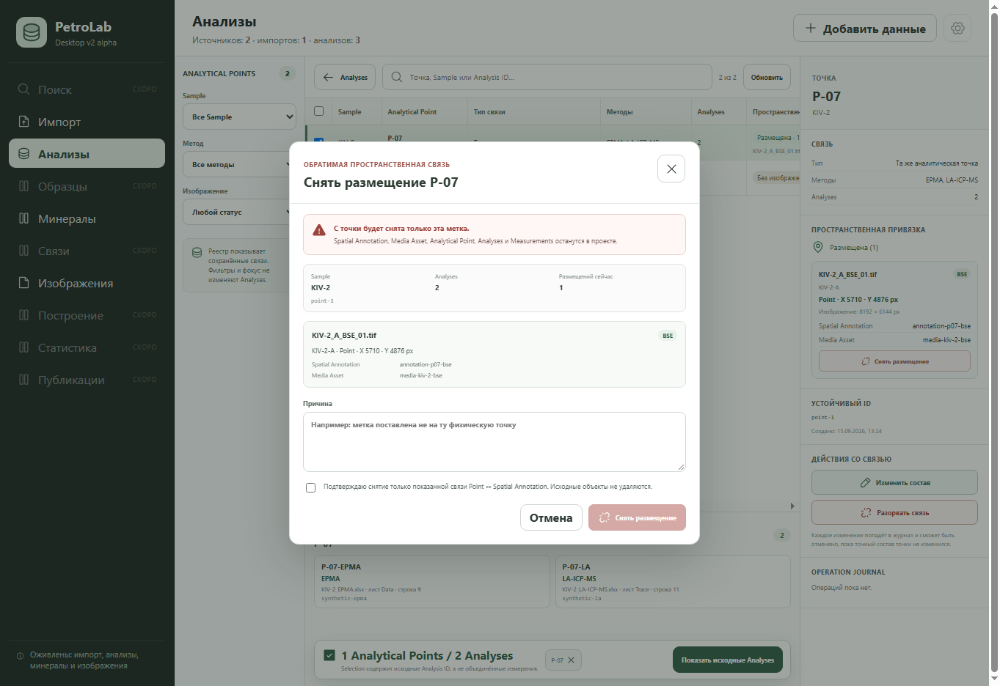

# Срез 0 — снятие сохранённого размещения

Статус: завершён 2026-09-22.

## Результат

Из реестра Analytical Points пользователь выбирает одну сохранённую пространственную привязку и снимает только связь `Analytical Point ↔ Spatial Annotation`. Перед применением UI показывает точку, Sample, число Analyses, число размещений, изображение, геометрию и оба устойчивых ID. Причина и явное подтверждение обязательны.

Не удаляются `Spatial Annotation`, `Media Asset`, `Analytical Point`, `Analysis`, `Measurement` и исходные файлы. Операция записывается в Operation Journal. `Undo` восстановит исходную связь с прежними provenance-полями, только когда точный состав точки и самой связи не изменился; иначе сервис возвращает конфликт ревизии и ничего не перезаписывает.

## Приёмка

- Python: удаляется ровно одна relation, связанные научные сущности остаются, Undo восстанавливает тот же `spatial_annotation_id` и `media_asset_id`.
- Python: устаревший scope отклоняется без записи.
- NDJSON: команда `analytical_point.annotation.remove` и `operation_journal.undo` сохраняют коррелированный результат.
- UI: причина и подтверждение блокируют отправку до заполнения; после снятия показан Undo; после Undo снова виден статус размещения.
- Визуально: проверен диалог при 1363×936 в актуальном browser-only QA fixture.
