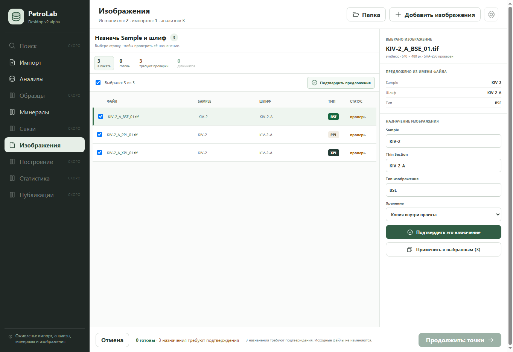

# QA: quiet assignment для импорта изображений

**Статус:** завершено, 2026-09-23.

## Проверенный результат

- Шаг назначения использует один табличный список вместо повторяющей его боковой
  очереди.
- Счётчики пакета фильтруют строки «требуют проверки» и «дубликаты»; они доступны
  как кнопки, а их изменение объявляется через существующую live-сводку.
- Клавиши `ArrowUp`, `ArrowDown`, `Home`, `End`, `Enter` и `Space` работают на
  строках единственного списка. Фокус меняет только выбранное изображение.
- Массовая панель появляется только при двух и более отмеченных изображениях.
  Для одной строки доступно отдельное подтверждение её назначения.
- Дубликаты по-прежнему исключаются лишь из временного пакета и могут быть
  возвращены. Типы BSE/PPL/XPL и пользовательский тип сохраняют прежнее поведение.
- Нижняя панель объясняет причину disabled-перехода и единожды сообщает, что
  исходные файлы не изменяются.

## Визуальная приёмка

Скриншот получен в browser-only fixture с тремя TIFF-изображениями 640×480,
viewport 1363×936. Он соответствует эталону
`docs/design/reference/screens/image-import-sample-assignment-v2.png`.

## Автоматические проверки

- профильные UI-проверки единого списка, клавиатурной навигации, массовых действий,
  исключения дубликатов и пользовательского типа;
- полный `desktop/tests/import-ui.e2e.test.jsx`;
- `desktop/tests/tauri-shell-contract.test.mjs`;
- production build Vite.
