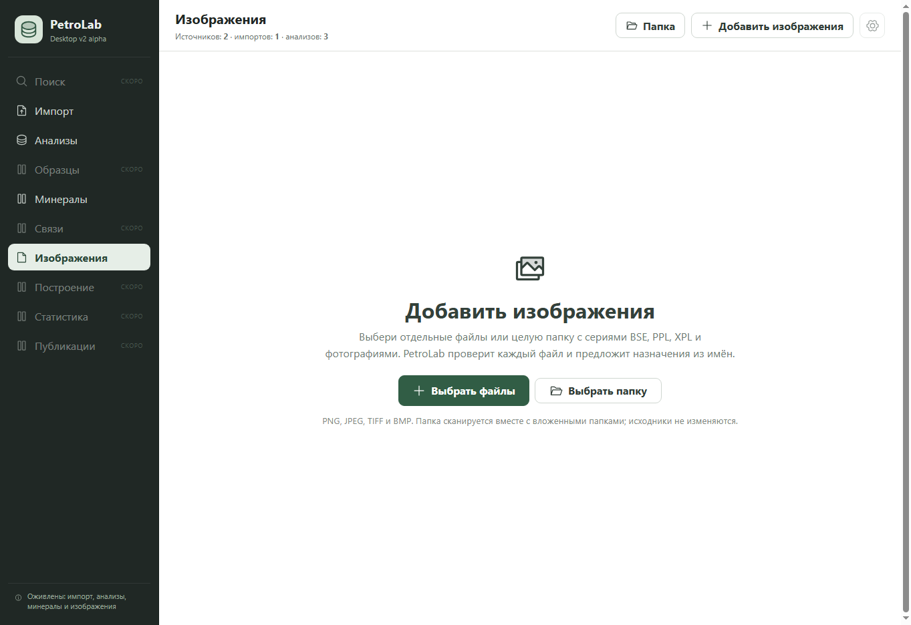
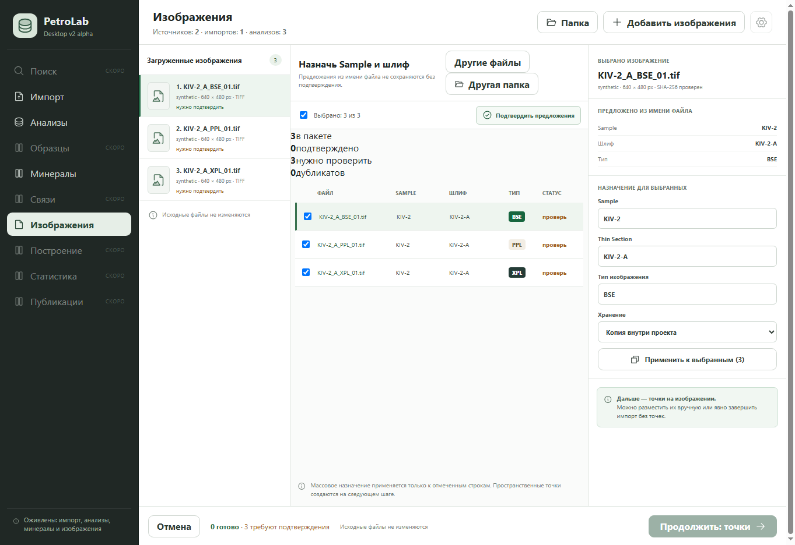
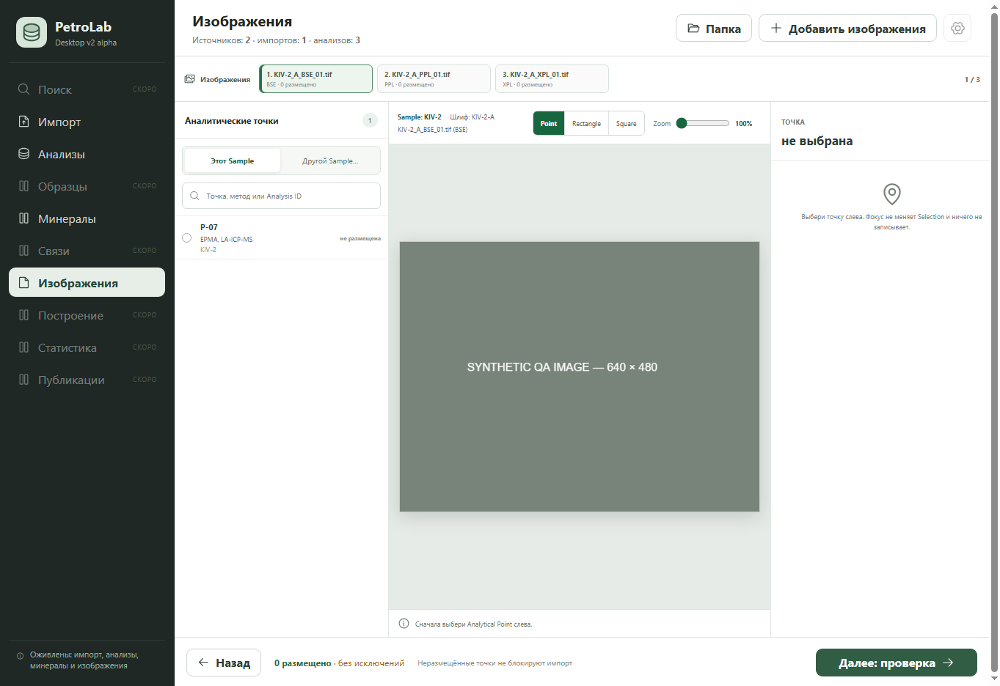
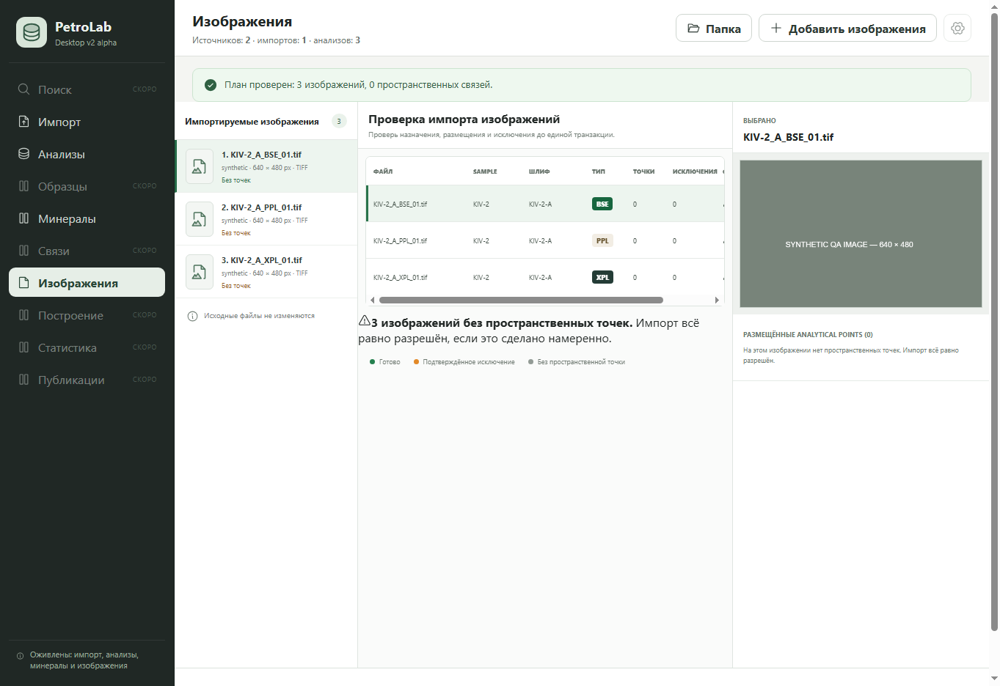
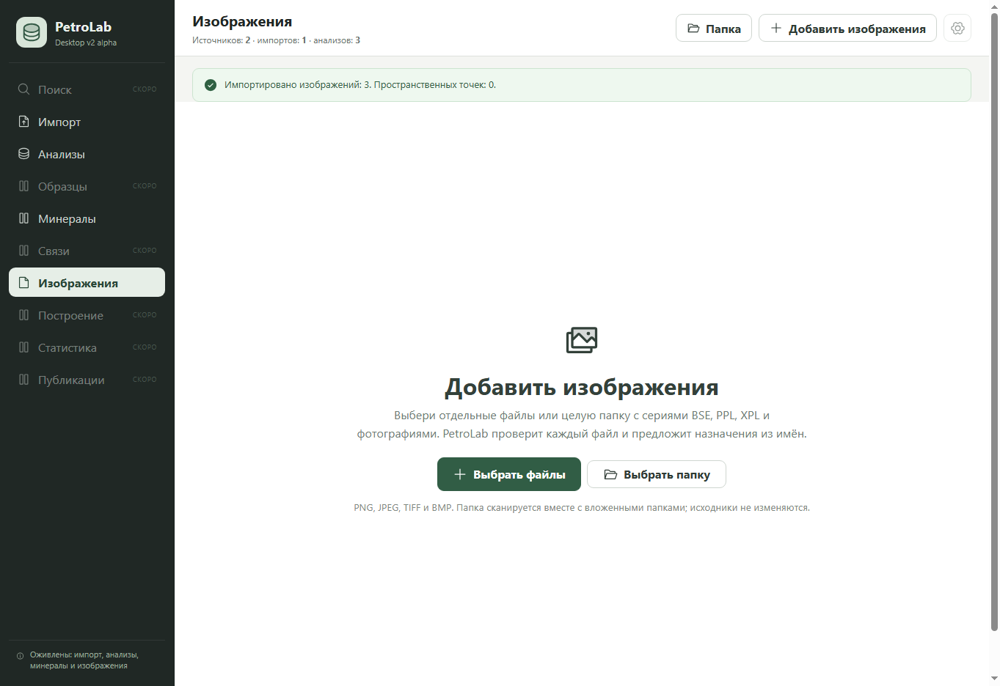
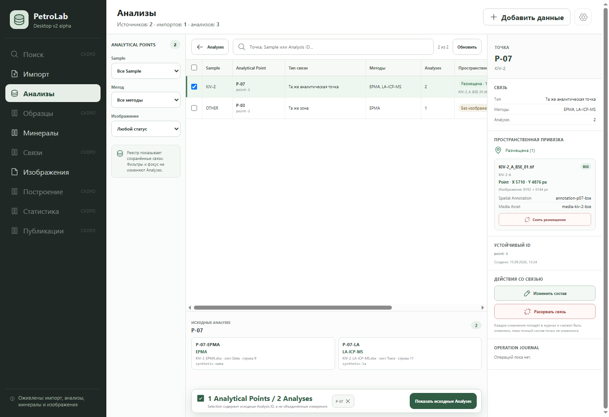
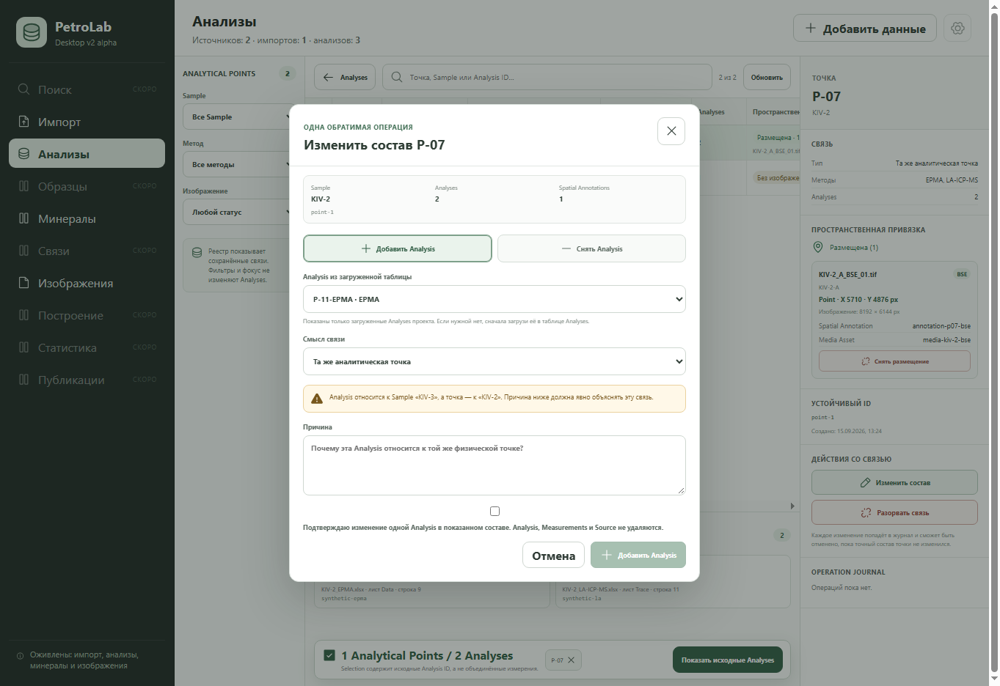

# Аудит изображений и аналитических точек — 2026-09-22

## Вывод и цель

Основа импорта и связей существует, но цикл повседневной работы не замкнут: после импорта нет библиотеки, из которой можно снова открыть изображение и продолжить работу с размещениями. Прежде чем добавлять сравнение и экспорт, нужно замкнуть этот цикл и освободить место для изображения.

Цель: пользователь находит сохранённую картинку, открывает её с метками, выбирает аналитическую точку, размещает или исправляет её, отменяет ошибку и возвращается после перезапуска без потери контекста. Исходные изображения и измерения не изменяются; фокус, фильтр и Selection остаются разными действиями.

## Основания и ограничения

- HEAD: `55f2abb feat(analyses): edit analytical point membership`.
- В рабочем дереве уже есть незавершённое снятие пространственного размещения с Undo: 10 изменённых файлов. Оно включено в видимый интерфейс, но не считается завершённым срезом.
- В этом аудите production-код не менялся, коммит и push не выполнялись. Новые материалы — этот отчёт и семь скриншотов.
- Снято в текущем запуске Edge, viewport 1363×936, через `desktop/tests/media-browser.html`. Это настоящий React UI с синтетическими данными и имитацией сервиса, не нативный Tauri и не настоящие микрофотографии.
- Пройден импорт без размещений; осмотрены редактор точек, реестр и диалог состава. Точность реального размещения, Undo в реальной БД, перезапуск приложения, большие TIFF, сотни меток, клавиатурная навигация и screen reader в этом аудите не проверены. Скриншоты не доказывают WCAG-соответствие. Все семь файлов открыты и визуально проверены.
- План опирается на PRODUCT_UX_MASTER_SPECIFICATION §§12–13, DESKTOP_V2_IMPLEMENTATION_SEQUENCE (изображения/точки), SCIENTIFIC_RULES, DOMAIN_MODEL и действующие ограничения AGENTS.md. Новые компоновки ниже — предложения, не утверждённые эталоны.

## Проверенные шаги

### 1. Вход в изображения — понятный старт, но только импорт

Файлы и папка доступны, ограничения форматов видны. Основные действия дублируются в шапке и центре. Неактивные разделы «СКОРО» постоянно занимают навигацию.

### 2. Назначение образца и шлифа — работает, перегружено

Предложения требуют подтверждения, что правильно. Но слева и в центре повторяется список файлов; справа одновременно видны сведения и массовая форма. Счётчики «3в пакете / 0подтверждено…» визуально не оформлены. Массовое назначение нуждается в более явной области применения: выбранный файл и отмеченные строки — разные вещи.

### 3. Редактор точек — рабочая основа, картинка зажата

Есть поиск, точки текущего образца, отдельный переход к другому образцу, три геометрии. Однако сама картинка занимает примерно 490 px по ширине при окне 1363 px: навигация, список и пустой инспектор постоянно открыты. Смешаны «Sample», «Analytical Point», «Point», «Zoom» и русский текст. Пустой инспектор занимает столько же места, сколько заполненный. Предлагается показывать его по запросу.

### 4. Проверка импорта — безопасная логика, слабая иерархия

Перед сохранением есть обзор назначений и явный статус отсутствия точек. Список файлов опять дублируется; таблица имеет горизонтальную прокрутку уже на трёх файлах. Нижнее действие в этом viewport находится ниже видимой области. Повторяются объяснения об импорте без точек и неизменности источников.

### 5. После импорта — критический разрыв продолжения работы

Сообщение подтверждает импорт трёх изображений, но основной экран вновь пустой и предлагает добавить изображения. Нет видимой библиотеки и действия «Открыть импортированные». Код `App.jsx:importImages` сбрасывает inspection/plan; текущая ImagesWorkspace обслуживает мастер импорта, а не просмотр сохранённой коллекции.

### 6. Реестр точек — содержателен, слишком плотный

Полезны фильтры, исходные анализы и сведения о размещении. Но таблица не помещается, а инспектор одновременно показывает связь, размещение, технические ID, дату, опасные действия и журнал. Мелкий текст и мелкие цели клика — риски доступности. Размещение представлено текстом, без перехода к изображению. Красные действия заметнее отсутствующего основного действия «Открыть изображение».

### 7. Изменение состава — защищено, но требует упрощения

Сохранены причина, подтверждение и предупреждение о другом образце. В открытом диалоге уже выбран кандидат другого образца и смысл связи «Та же аналитическая точка»: лучше требовать осознанного выбора кандидата, не предлагать случайный готовый вариант. Чекбокс визуально оторван от своего текста. Выбор ограничен анализами загруженной таблицы, о чём интерфейс честно сообщает, но это неудобная зависимость для пользователя.

## Риски, подтверждённые чтением кода, не сценарными тестами

1. `ImagesWorkspace.jsx` подписывает анализы через `selectedPoint.methods[index]`, тогда как `media_import.py` собирает уникальные методы. У массивов нет гарантированного соответствия по индексам. Нужны подписи по Analysis ID и проверка нескольких анализов одного метода.
2. `AnalysesWorkspace.jsx` при переходе к исходным анализам отфильтровывает ID, отсутствующие в загруженном `analyses`. `App.jsx` загружает страницы по 500. Нужен полный переход по выбранным ID или явное сообщение о недоступной части, а не молчаливое усечение.
3. Preview ограничен 1600×1200; текущий Zoom увеличивает размер отображения, а не обеспечивает исходную детализацию. Нельзя называть его настоящим 1:1. Панорамирование, масштаб вокруг курсора и точная клавиатурная коррекция требуют отдельного среза.
4. Черновики размещения находятся в состоянии React. Восстановление после перезапуска не реализовано в этом пути; нужна отдельная политика сохранения/выхода, не обещание автоматической сохранности.

## Предлагаемый порядок минимальных срезов

Каждая строка — отдельная поставка с тестами и наблюдаемой приёмкой; при необходимости API и UI делаются внутри одного вертикального среза. Не объединять весь список в один большой рефакторинг.

| № | Срез | Проверяемый результат |
|---|---|---|
| 0 | Завершить начатое снятие размещения | Снимается только выбранная связь; другие размещения и анализы остаются; Undo восстанавливает точную связь; конфликт состояния объясняется. Закрыты тесты и визуальная проверка. |
| 1 | Исправить достоверность состава | Метод и источник берутся по ID анализа; переход к исходным анализам не теряет ID на границе 500 строк. Тесты на повторяющиеся методы и незагруженные анализы. |
| 2 | Очистить мастер импорта | Один список файлов, оформленные счётчики, массовые поля свёрнуты до выбора нескольких файлов, единая терминология, доступный нижний переход. Сначала компактная спецификация/эталон, затем реализация. |
| 3 | Библиотека сохранённых изображений | После импорта и после перезапуска видны те же файлы; поиск по имени и фильтр образца; отсутствие внешнего файла объясняется. Без редактора и сравнения в этом срезе. |
| 4 | Открыть сохранённое изображение с метками | Библиотека и реестр открывают нужный файл; выбранная точка подсвечена; показаны все сохранённые размещения. Чтение не меняет Selection и БД. Пока без редактирования. |
| 5 | Удобная область изображения | Сворачиваемые панели, «Вписать», панорамирование, масштаб вокруг курсора, видимый масштаб preview. Координаты не меняются при zoom/resize. Для исходного 1:1 — отдельное решение загрузки деталей после замера реальных TIFF. |
| 6 | Добавить размещение после импорта | Уже сохранённой картинке можно назначить существующую точку без повторного импорта; причина для другого образца, журнал и Undo. |
| 7 | Исправить сохранённое размещение | Перенос/изменение области с предпросмотром, применением/отменой, защитой от устаревшего состояния и Undo. Не превращать смену фокуса в запись. |
| 8 | Компактный реестр и карточка точки | По умолчанию имя, образец, методы, число анализов, размещение. ID, даты и журнал — в раскрываемых подробностях; «Открыть изображение» — основное действие; исправлен чекбокс и явный выбор кандидата. Нужен утверждённый эталон. |
| 9 | Быстрая последовательная расстановка | Поиск уже есть: добавить «Следующая неразмещённая», понятный прогресс, Enter/Esc, показ/скрытие подписей. Проверка на плотной сцене без перекрытия выбранной метки. |
| 10 | Защита незавершённой работы | Выход предупреждает о несохранённом; черновик восстанавливается после перезапуска, а изменённый/пропавший источник не применяется молча. Отдельно сохранять viewport, не смешивая его с геометрией. |

Для каждого среза: связанные контракты, `python scripts/validate_contracts.py`, `python -m unittest discover -s tests`, соответствующие UI/AT-проверки, build и свежие скриншоты. Приёмка сохранённых изображений — на реальной БД с повторным открытием; навигации — на настоящей микрофотографии. До этого нельзя объявлять весь сценарий готовым.

## После основного цикла, не сейчас

- Исходная детализация больших TIFF: сначала измерения памяти/задержки и выбор ограниченной загрузки; затем честный режим 1:1.
- Сравнение BSE/PPL/XPL: общая аналитическая точка, независимые координаты; никакого автоматического совпадения пикселей без явного преобразования.
- Экспорт подписанного изображения: отдельная производная копия с метками в исходных координатах, оригинал не перезаписывается.
- Проверка масштаба коллекции и плотности меток на согласованных реальных данных; оптимизация по замерам, не предварительное усложнение архитектуры.

## Предлагаемое правило визуальной простоты

На экране постоянно видны только изображение, выбор точки и основное действие. Образец/шлиф/тип — одна компактная строка. Источник, устойчивые ID, история и редкие операции доступны в подробностях. Предупреждения показываются там, где требуется решение; подтверждение межобразцовых исключений и происхождение данных не удаляются ради чистоты интерфейса.

Следующий шаг после рассмотрения аудита — срез 0, затем 1. Перед существенными изменениями компоновки согласовать обновлённый эталон согласно AGENTS.md. Этот отчёт не является разрешением молча заменить утверждённые экраны.
