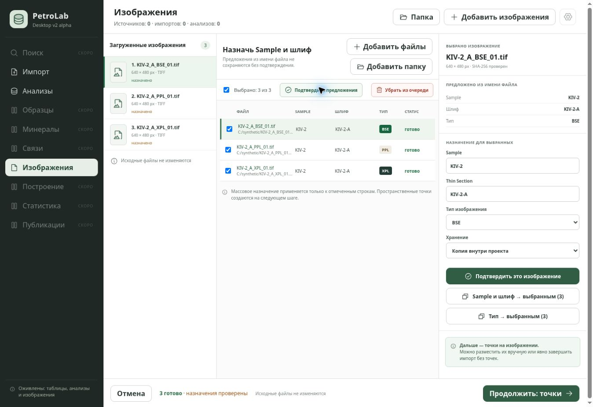
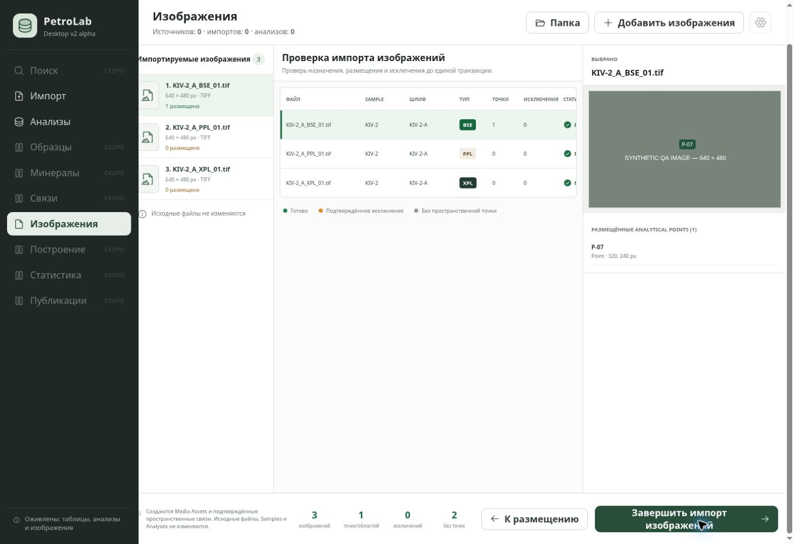

# Image queue continuation — 2026-09-10

Scope: PR #19, based on `a17d3d2`; siblings #17 and #18 were inspected and
their current Architecture contracts and Windows test build runs passed.

## Fixed behavior

- Adding files/folders extends the queue and keeps reviewed assignments and
  saved placements for unchanged source path/SHA-256 pairs.
- New/changed items return to assignment review before placement controls can
  render; a regression test reproduced a blank-screen crash without this guard.
- Changed source files show an explicit warning and require fresh confirmation.
- Navigation to Analyses and back retains the image workspace, including its
  placement phase. This is in-session retention, not restart persistence.
- Selected entries can be removed without changing source files. Reinspection
  recomputes duplicate groups, so removing a duplicate unblocks review.
- Bulk Sample/Thin Section does not overwrite BSE/PPL/XPL/custom type or storage
  mode. Single-image confirmation and explicit bulk-type assignment are separate.
- Folder selection uses the existing native `null | string[]` contract. Empty
  folders and cancelled selection preserve the existing queue.
- Previews from an earlier inspection cannot overwrite a newer batch preview.

## Verification

- `PYTHONPATH=src python scripts/validate_contracts.py`: PASS.
- `PYTHONPATH=src python -m unittest discover -s tests`: 135 PASS.
- React UI: 10 PASS, including four new queue/navigation/source-change scenarios.
- React + real Python NDJSON service: 5 PASS, including saved analysis data,
  two-source review, semantic range undo and mineral interpretation separation.
- Tauri source contracts: 22 PASS; Sites packaging: 4 PASS.
- Production Vite build and packaging: PASS.
- Added a native Rust filesystem test for recursive discovery, deterministic
  order, uppercase extensions and exclusion of `.bat` scripts. Windows CI now
  runs `cargo test` before building/installing the release installer. Rust is not
  installed in the local Linux execution environment; native evidence comes
  from the PR's Windows workflow, not source-contract tests.

Browser walkthrough used `desktop/tests/media-browser.html` with an explicitly
synthetic picker/service fixture. It is not imported by the production entrypoint
and is not included in the production bundle. Checked folder assignment,
per-file modalities after bulk Sample editing, manual P-07 placement, navigation
to Analyses/back, and final review showing the saved point at (320, 240) px.
This walkthrough proves visible interaction, not a native dialog or database write.

The review screenshot exposed clipped columns and a footer wider than its
workspace. The final CSS makes the table horizontally scrollable and allows the
central grid column to shrink. A subsequent live DOM check measured both the
workspace and footer at 1110 px, with equal scroll widths and zero horizontal
scroll offset; all footer controls fit. The attached review screenshot records
the defect before that correction.

The three-pane assignment layout, green status hierarchy, explicit confirmation
and source-preservation notice retain the approved screen's structure. Existing
differences remain: assignment uses text fields rather than existing-entity
pickers, and the assignment list uses file icons rather than raster thumbnails.
These are not claimed complete by this continuation.

Supported image containers remain PNG, JPEG, TIFF and BMP. No actual proprietary
BAT image fixture or format specification was available; `.bat` command scripts
remain excluded. No scientific formulas, measured values or media source bytes
were changed by this patch.
