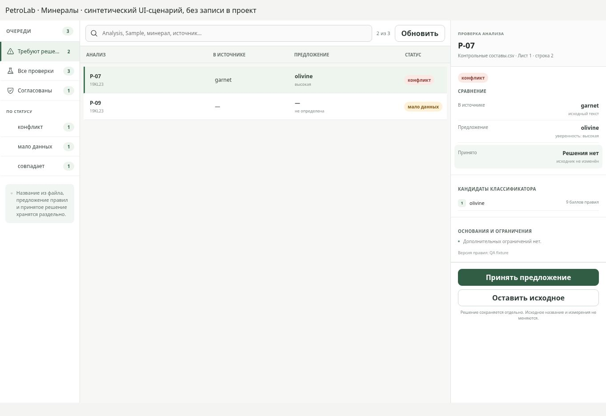
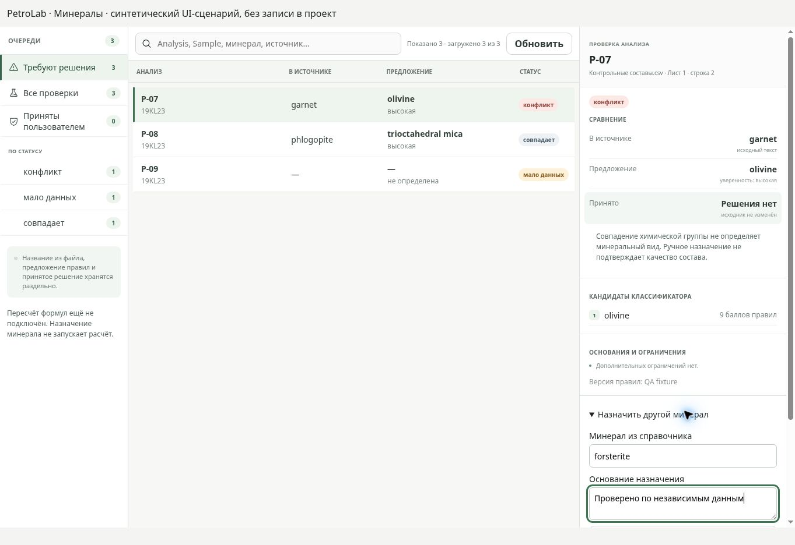
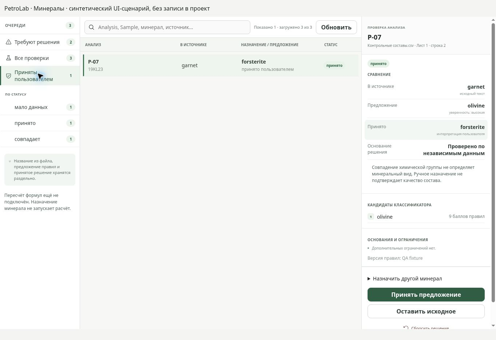

# Проверка определения и назначения минералов — 2026-09-11

Исправление поверх PR #18. Пересчёт структурных формул пока не реализован.
Подробное продолжение: [MINERAL_FORMULA_CONTINUATION](../product/MINERAL_FORMULA_CONTINUATION.md).

## UI-сценарий и результаты

Проверен настоящий компонент MineralsWorkspace в браузере, viewport 1363 × 936.
Источник — явно обозначенный синтетический fixture `desktop/tests/minerals-browser.html`.
Его обработчики меняют только состояние React. Сохранение в SQLite проверено
отдельными Python и real-service интеграционными тестами.

1. Очередь: автоматическое совпадение остаётся требующим решения. Переименование
   «Согласованы» в «Приняты пользователем» устраняет ложное впечатление проверки.
2. Ручной выбор: forsterite доступен независимо от предложения olivine. Без основания
   сохранение недоступно; после ввода причины — доступно. Tab переводит фокус на
   сохранение, Enter выполняет действие. Счётчики меняются с 3/0 на 2/1.
3. Принятое решение: forsterite видно в центральном списке и справа; исходный garnet,
   предложение olivine и основание остаются раздельными.
4. Сброс: нажатие «Сбросить решение» возвращает счётчики к 3/0, принятая очередь
   становится пустой; исходная конфликтная проверка снова доступна.

При раскрытии длинной формы правая панель прокручивается независимо от очереди.
Горизонтального переполнения в проверенном viewport нет. Подписи очередей теперь
переносятся; размер текста списка увеличен. Видимый focus оформлен отдельно.
Кнопки внизу длинной правой панели требуют прокрутки: это допустимый текущий
компромисс, который следует проверить на минимальном нативном окне.

## Визуальное сравнение

До исправления: обрезанное название очереди, автоматическое совпадение в согласованных,
нет произвольного назначения и явного сообщения о недоступности формул.

Форма ручного назначения после исправления прокрутки. Снимок сделан перед последним
уточнением заголовка центральной колонки.

Итоговое принятое назначение:

Сопоставлен утверждённый `docs/design/reference/screens/import-mineral-mapping-v1.png`:
сохранены светлая трёхпанельная структура, зелёный акцент выбора, разделение источника
и интерпретации, правая панель проверки. Полного соответствия экрану импорта нет:
эталон включает массовый выбор, настройку метода и расчёт, а текущий отдельный экран
после импорта обслуживает решения по одной строке. Эти функции не объявляются готовыми.

## Проверки

- Python: 140 тестов, включая миграцию v11 → v12 с историей, backup, integrity/FK,
  сохранение ручной разметки при импорте и неизменность исходного файла.
- React/UI и real Python service: 12 тестов.
- Tauri contract и Sites packaging: 25 тестов.
- Валидация контрактов, production Vite build и `git diff --check`: успешно.
- Нативное установленное Windows-приложение локально не проверялось; cargo недоступен.
  Статус CI необходимо проверять по опубликованному commit, а не по родительскому PR.

## Ограничения и следующий шаг

Изменение версий входного gate/словаря меняет fingerprint: прежнее принятие предложения
может потребовать повторной проверки. История сохраняется; ручная разметка диапазона
не превращается в устаревшее научное принятие.

Отсутствующие F/Cl допускаются только для ограниченного проверенного случая оливина;
требование полного ядра, включая K2O, сохраняется. Нет исполняемого реестра формул.
Остались проверка окна малого размера/200%/screen reader, нативные диалоги, сохранение
черновика при смене анализа, полный поиск по проекту и массовые назначения.
Первый следующий вертикальный этап — оливин APFU/Fo–Fa с методом, Fe-допущением,
provenance, сохранением и независимыми научными benchmarks; затем слюды.
