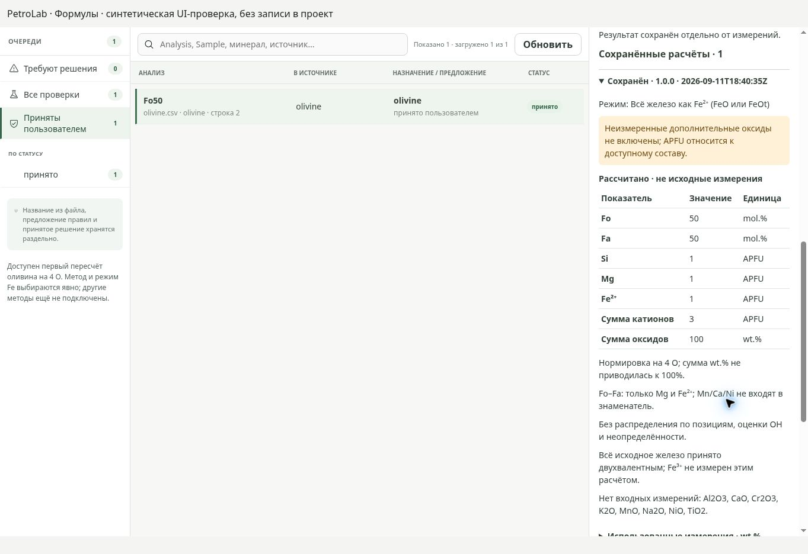
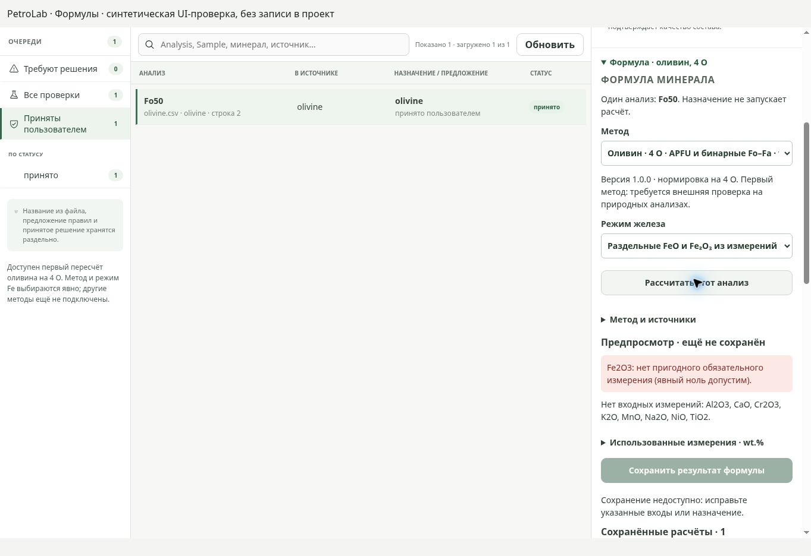

# Приёмка первого формульного пересчёта

## Объём

Первый постимпортный метод оливина на 4 O. Не полный модуль всех минералов.
UI: один явно выбранный анализ. Научный метод остаётся draft до внешних природных
benchmarks; идеальные стехиометрические ожидания подготовлены независимо от функции.

## Научная проверка

Источники алгоритма и масс перечислены в ADR 0019 и возвращаются каталогом метода.
Эталоны используют независимые формульные массы SiO₂ 60.083, MgO 40.304 и FeO 71.844.
Mg₂SiO₄ → Si=1, Mg=2, Fo=100; Fe₂SiO₄ → Si=1, Fe²⁺=2, Fa=100;
MgFeSiO₄ → Si=Mg=Fe²⁺=1, Fo=Fa=50. Допуск 1e-12 APFU в идеальных случаях.
Состав Si₁Mg₁Fe₀.₇Mn₀.₁Ca₀.₁Ni₀.₁O₄ сохраняет примеси отдельно; Fo=100/1.7.
Раздельное железо проверено без переоценки Fe³⁺; исходный total-Fe под видом
канонического FeO/Fe₂O₃ в режиме раздельных измерений отклоняется.

Проверены missing, censored, ноль, отрицательные/нечисловые/нефинитные значения,
единицы, дубли компонентов, отсутствующие дополнительные входы и смешанные формы Fe.
Изменение состава/назначения/метода, отказ транзакции, повтор запроса и открытие
проекта не приводят к молчаливой перезаписи результата или Measurements.

## Наблюдаемый UI-путь

Real-service интеграционный тест: импорт → принятие оливина → экран минералов →
явный Fe-режим → APFU → сохранение → другой экран → открытие сохранённой истории.
Смена Fe-режима убирает старый предпросмотр. Отсутствующий Fe₂O₃ блокирует сохранение.
Исходный CSV после сценария побайтно совпадает с первоначальным.

Browser QA при 1363 × 936: тот же компонент, синтетические ответы, заранее
полученные из Python. Это проверка отображения и управления, не записи в SQLite.
Проверены Enter для расчёта, сохранение, раскрытие истории, ошибка и disabled-кнопка.
Правая панель прокручивается независимо, очередь остаётся на месте; ширина документа
равна viewport. Полный метод/version показан дополнительно к тесному select.
Fo/Fa подняты в начало таблицы, технические имена APFU заменены подписями элементов.

Сравнение с утверждённым import-mineral-mapping-v1: сохранены три панели,
зелёный акцент и явные метод/Fe-допущение/принятие. Массовый выбор и расчёт до
сохранения импорта из полного эталона сюда не перенесены и не заявляются готовыми.
В малом нативном окне и при 200% результат ещё не проверялся.

## Проверки и Windows

Результаты локальных команд и актуальный CI commit записываются в описании PR.
Родительский PR #20: Architecture contracts success; Windows run 34605583627
упал на frontend tests до создания инсталлятора. В этом изменении тестовый сервис
ожидает готовности, безопасно обрабатывает закрытие и имеет отдельный Windows budget
ожидания UI. Это не является доказательством успешной Windows-сборки без её CI.

Дальнейшие действия: [OLIVINE_FORMULA_CONTINUATION](../product/OLIVINE_FORMULA_CONTINUATION.md).
