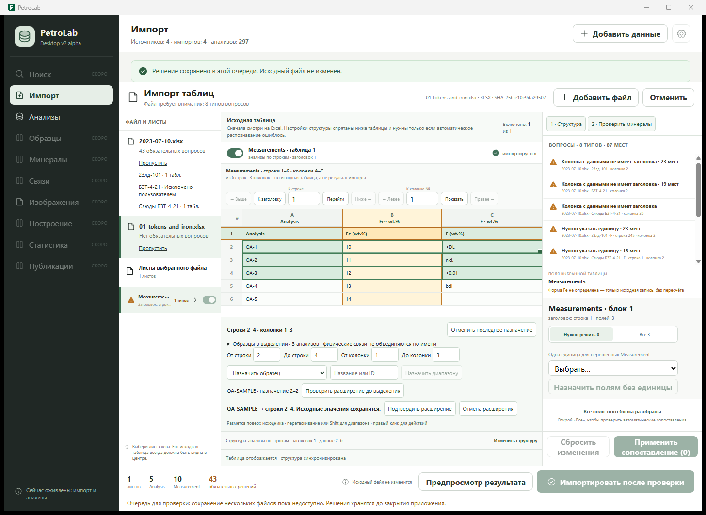
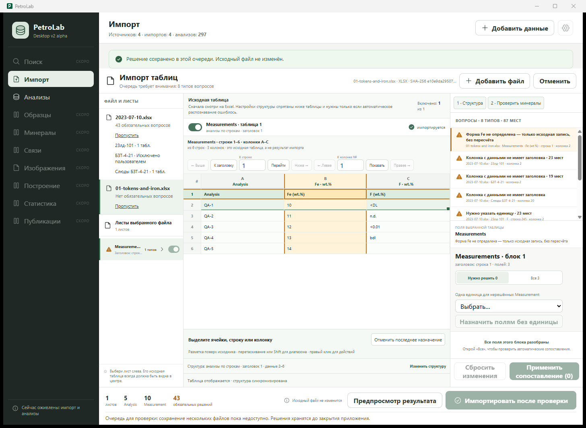
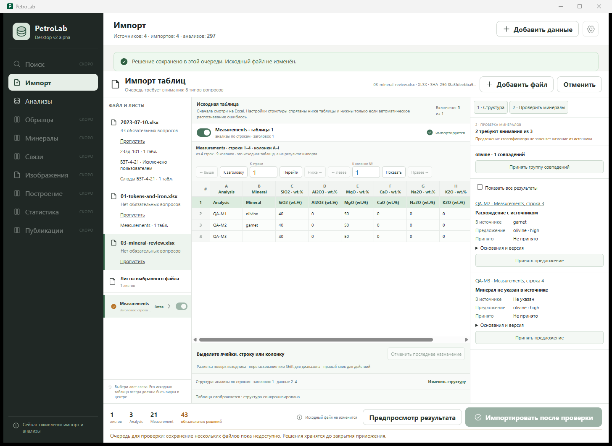
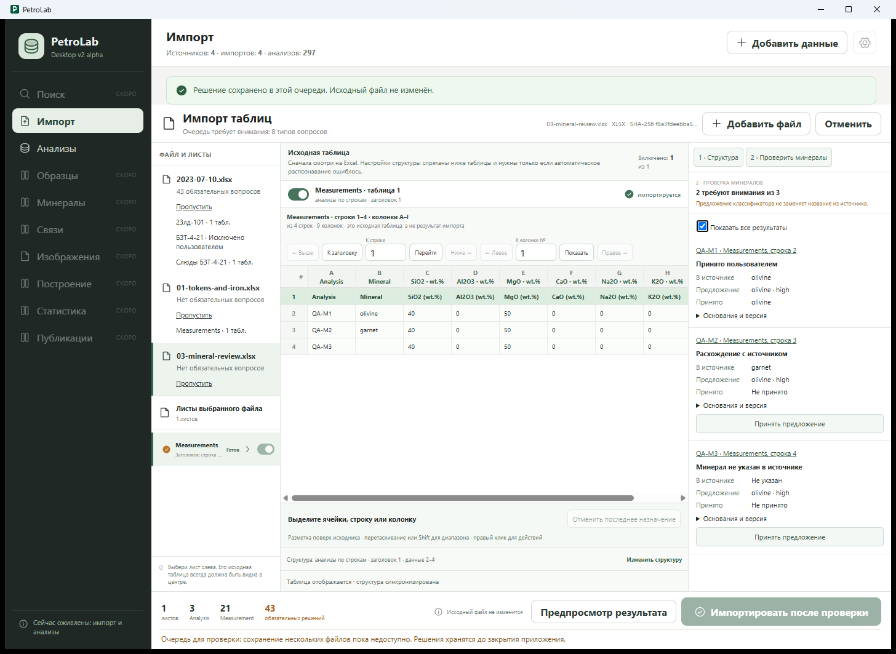

# Excel-import verification — 2026-09-06

Scope: user-requested import hardening and semantic review on top of PR #16.
This is a development verification, not a claim of release readiness or complete
physical-Sample linking. Product Design audit of the native Tauri workflow
guided the fixes; no new architecture or scientific formulas were put in React.

## A. Workflow

One Python-owned transient review queue retains separate recipes, inclusion
decisions and source fingerprints. The physical Excel table stays central while
sources are selected on the left and issues resolved on the right. Unapplied
mapping/structure edits block navigation; automatic suggestions are not edits.
One valid mapping can be applied without resolving every other field first.
Single-source save still commits and displays the resulting analyses.
Multi-source review explicitly cannot commit yet (ADR 0014).

## B. Dictionary

Version 2026.09.1: 118 element symbols with English/Russian aliases, supported
oxides, Total/LOI and deterministic isotope/ratio notation. Exact matches, safe
normalization, explicit aliases and project-confirmed aliases are distinguished.
Fuzzy results are never automatic. Header evidence and units remain separate.
A bare percent sign is not automatically treated as wt.%.

## C. Headers newly recognized

The real-world matrix contains 137 file/sheet/header/unit recognition entries
beyond the prior fixed field map, not 137 unique analytes. Examples: Ce2O3, SrO,
BaO, V2O5, ZrO2, SO3, ZnO, La2O3, Nb2O5, Ta2O5, UO2, Y2O3,
007Li → 7Li, 047Ti → 47Ti, 088Sr → 88Sr and 238U.
Co/Ca, S/Si and Na/Nb stay distinct. Recognition without a unit does not create
a ready Measurement. The corpus manifest changes are explained by new exact
recognition: 2016-05-04 gains 121 measurements and unresolved fields fall from
157 to 142; mica's BaO/SO3 are recognized but still need units, so its blanket
unrecognized-field scope disappears. Analysis counts and file hashes stay fixed.

## D. Sample detection

Explicit Sample ID/name columns and bounded merged cells retain reported labels
and cell provenance. Preamble/adjacent labels, matching worksheet labels and
identifier patterns yield unconfirmed suggestions. Users can assign a label to
an explicit range. Filename never becomes a Sample. Missing Sample stays allowed.

## E. False-merge protection

Reported label is not a physical Sample entity. All unconfirmed records remain
unlinked, even if names repeat between blocks/files. No automatic Sample entity
merge is performed. The matrix's zero automatic merges describes this code path,
not validated geological ground truth or a measured false-merge rate.
A picker/link to existing physical Sample IDs is still missing (see M).

## F. Semantic ranges

Cell, row, column and rectangle selection; drag/Shift and keyboard-accessible
numeric bounds; visible action area and right-click equivalent. Roles include
Sample label, Sample ID/name column, Analysis ID, Mineral, component, unit,
header/block, metadata, method and Ignore. Source-bound annotations are layered
over original cells; undo restores interpretation/recipe state. Partial Ignore
on an identity cell clears identity and blocks save rather than retaining a
hidden identity. Whole-row Ignore removes the planned record, not source data.

## G. Fill

An existing annotation can be extended with a handle or numeric range. Python
previews the exact proposed bounds before explicit confirmation. Conflicting
assignments, repeated headers, blank separators and other blocks reject unsafe
extension. Cancel does not mutate; undo restores the preceding annotation range.
No implicit fill into raw cells or across workbook boundaries.

## H. Mineral verification

Stage 1 structure/identity review precedes Stage 2. Five existing PetroLab
scientific-only modules were reused unchanged; portable SHA-256 snapshot tests
guard them (classifier-source-manifest.json). No old Streamlit UI/database was
copied. A conservative input gate rejects missing/censored core chemistry,
incompatible units and ambiguous iron; no fabricated zero or concentration
conversion. Reported text, range assignment, prediction and explicit acceptance
are stored separately, with version and input fingerprints. Only homogeneous
high-confidence consistent groups offer bulk acceptance; conflicts require
individual review. Scientific accuracy still needs labeled expert validation.

## I. Concrete examples and native findings

1. Real 2023-07-10.xlsx: headers at rows 245 and 202 and a third sheet at row 1.
   The earlier empty-header warnings incorrectly reused probe rows; now actual
   block headers drive mapping issues. Its two drawing-bearing sheets explicitly
   say embedded images are not rendered. The workbook has 43 media objects:
   drawings are not silently converted into chemistry or described as empty cells.
   Full first-pass plan: 92 analyses, zero ready measurements, 61 unresolved fields.
   With the user's БЗТ-4-21 exclusion retained: 59 analyses, 43 blockers.
   F/Na/Mg/Si and absent units are not silently reinterpreted as oxides/wt.%.
2. Generated token fixture: <DL, n.d., <0.01, bdl and missing stay raw; Fe stays
   unresolved as reported. QA-SAMPLE range 2 → 2–4 was previewed, confirmed and
   undone natively. No test analyses were saved in the user's project.
3. Generated mineral fixture: identical olivine-like chemistry with reported
   olivine, garnet or blank yields consistent, conflicting and missing-reported
   review states. Bulk acceptance accepted only the consistent item.
4. Compact window: fixed viewport sizing, initial physical-header navigation,
   180px minimum raw area, 64px minimum action area and wrapping inspector actions
   keep data and controls accessible at the supported 1180 x 800 window size.
   Long labels and tables still need scrolling; accessibility is not certified.

## J. Real-world regression matrix

[Full per-block evidence and hashes](semantic-import-matrix-2026-09-06.json):
10 unique files, 129 blocks, 3,619 planned analyses; sources were checked read-only.
No owner-labeled Sample or mineral ground truth was supplied.

| File | Blocks | Analyses | Measurements | Unresolved fields |
|---|---:|---:|---:|---:|
| 2016-05-04.xls | 21 | 146 | 2487 | 142 |
| 2021-11-12.xlsx | 23 | 294 | 0 | 155 |
| 2026-08-05.xlsx | 12 | 137 | 2273 | 0 |
| 26-08-10.xls | 3 | 79 | 0 | 49 |
| For Sazonova_Analysis_20_02_20 (1).xlsx | 47 | 536 | 969 | 995 |
| mica+Chl_all_zond.xlsx | 3 | 22 | 0 | 48 |
| MORB.xlsx | 1 | 1987 | 5961 | 1 |
| анализы гранатов из литературы .xlsx | 3 | 164 | 0 | 242 |
| Результаты SIMS (Cpx+Grt).xlsx | 13 | 162 | 0 | 706 |
| 2023-07-10.xlsx | 3 | 92 | 0 | 61 |

## K. Verification

| Check | Result |
|---|---|
| python scripts/validate_contracts.py | PASS |
| python -m unittest discover -s tests | PASS: 129 |
| npm run test:ui | PASS: 9 (4 UI/mocked boundary + 5 actual Python NDJSON integration) |
| npm run test:tauri-contract | PASS: 19, including watcher and compact-layout checks |
| npm run build | PASS |
| npm run test:sites | PASS: 4, after build |
| npm run tauri dev | PASS: one Vite, Cargo, WebView2, responsive Tauri + Python service |
| Existing project comparison | PASS: 297 analyses; 17 original tables/columns identical to pre-v10 backup |
| Source SHA-256 checks | PASS; real workbook 51a833c86bf3881c95470c47ccfa27bd8d91f557c4a44dcc40ef865bcecb7ef9 |

Migration 0009/0010 tests include populated existing data and backup preservation.
The real project was checked read-only against the pre-v10 backup; this does not
claim retrospective native validation of every earlier migration.
No npm installs, destructive Git commands or second Vite were used.

## L. Screenshots and UX acceptance

Accepted native capture sequence:

1. Source/table review — functional. The original worksheet is central and
   navigation exposes its physical header. Final real-workbook screenshots
   12-native-minimum-fixed.png and 13-native-final-workbook.png remain local under
   docs/qa/screenshots; original measured values are not uploaded with this PR.
2. Range preview — functional, explicit confirmation, raw tokens visible.
   
3. Confirm and undo — functional, no source changes.
   
   
4. Mineral conflicts and safe group acceptance — functional.
   
   

The range/mineral captures document the interaction before the later probe-warning
and compact-layout fixes; their background queue warnings are not the final
baseline. Current real-workbook state has five issue groups / 44 locations.
Comparison with the approved columns/block reference verified the table/inspector/
footer relationship, not pixel identity to the earlier wizard chrome. Native
keyboard controls and focus were exercised selectively; screen-reader order,
all keyboard paths, contrast and high-DPI variants still require dedicated QA.

## M. Remaining work and release limits

- Existing physical-Sample selection/linking and conflict reconciliation are not
  implemented. Current labels/evidence must not be presented as confirmed links.
- Atomic multi-source commit and restoring review drafts after restart remain
  outside v1. The disabled action explains this; no sequential-save workaround.
- No embedded-image rendering, OCR or unit/oxide inference from drawings.
- Current PyInstaller executable predates these Python changes. Debug uses the
  editable core. Rebuild the sidecar and run packaged installer/clean-machine
  acceptance before release; native dev success alone is insufficient.
- Expert-labeled mineral/sample ground truth and broader transposed range/fill
  native acceptance remain needed. Ctrl-disjoint selection is not implemented.
- New semantic evidence is persisted and returned by the service; Analyses does
  not yet offer a full dedicated evidence/physical-link inspector.
- Reused classifier code is a versioned snapshot; future scientific updates need
  explicit review, new hashes and scientific regression evidence.
- Import orchestration in App.jsx and long range/inspector controls need a later
  focused maintainability/accessibility pass, without a new state manager.

Next smallest product slice: explicit physical-Sample linking within one source,
with a reviewed identity-conflict contract, then safe multi-source persistence
under a separate ADR. Do not infer either from matching names.

